# Urdu Children's Story Generation System — قصہ گو

## Project Overview

(Qissa Go — "The Storyteller")
is a full-stack generative AI system that produces short Urdu children's stories using classical probabilistic NLP techniques. Built without any pre-trained large language models, this system demonstrates how corpus engineering, subword tokenization, and n-gram language modeling can be combined into a production-grade microservice with a modern, reactive frontend

The system scrapes real Urdu stories from the web, trains a custom Byte Pair Encoding (BPE) tokenizer from scratch, fits a trigram language model with linear interpolation smoothing, and serves generation through a containerized FastAPI backend. A Next.js frontend deployed on Vercel provides a ChatGPT-style typewriter interface fully in Urdu.

This project was developed as Assignment 1 for **CS 4063 — Natural Language Processing**, bridging classical NLP foundations with modern software engineering practices.

---

## Assignment Objectives

- Scrape and preprocess a diverse corpus of at least 200 real-world Urdu stories with custom special tokens
- Train a custom BPE tokenizer with a vocabulary size of 250 — without using any pre-built tokenizer libraries
- Implement a trigram language model with Maximum Likelihood Estimation (MLE) and linear interpolation smoothing
- Serve the model via a containerized FastAPI microservice exposing a `POST /generate` endpoint
- Build and deploy a reactive Next.js frontend on Vercel with a typewriter-style story display
- Establish a full DevOps pipeline with Docker and GitHub Actions CI/CD

---

## System Architecture

The system follows a decoupled microservices architecture. The frontend communicates with the backend exclusively through a REST API, and all NLP processing is isolated within the backend container.

```mermaid
graph TD
    A[👤 User - Browser] -->|HTTPS| B[🌐 Next.js Frontend - Vercel]
    B -->|POST /generate - REST| C[🐳 FastAPI Backend - Docker Container]
    C --> D[🔤 BPE Tokenizer\nbpe_tokenizer.json]
    C --> E[📊 Trigram LM\nTrained at Startup]
    E --> F[📂 Tokenized_Data.txt\nPre-encoded Corpus]
    D --> F
    C -->|Generated Story JSON| B
    B -->|Typewriter Animation| A

    subgraph Data Pipeline [Offline Data Pipeline]
        G[🕷️ Selenium Scraper] -->|Raw .txt files| H[urdu_stories_dataset/]
        H --> I[BPE Training Script]
        I --> D
        I --> F
    end
```



---

## Technologies Used

| Technology | Purpose |
|---|---|
| Python 3.11 | Core backend language |
| Selenium + undetected-chromedriver | JavaScript-rendered web scraping |
| BeautifulSoup4 | HTML parsing and content extraction |
| FastAPI | REST API microservice framework |
| Uvicorn | ASGI server for FastAPI |
| Pydantic | Request/response schema validation |
| Next.js 16 | React-based frontend framework |
| React 19 | Component-based UI library |
| Tailwind CSS 4 | Utility-first styling |
| Docker | Backend containerization |
| GitHub Actions | CI/CD automation pipeline |
| Vercel | Frontend cloud deployment |
| Render / Railway | Backend container hosting |
| Conda | Scraping environment management |

---

## Project Structure

```bash
NLP_Assignment-1-main/
│
├── Scraping/
│   └── scarper.py                  # Selenium + BS4 scraper for UrduPoint
│
├── urdu_stories_dataset/           # 597 raw scraped Urdu story .txt files
│   ├── Aik_Chirya_Ki_Kahani_*.txt
│   └── ...
│
├── BSETokenizer/
│   ├── TokenizerCode.py            # Full BPE implementation (train/encode/decode/save/load)
│   ├── bpe_tokenizer.json          # Trained tokenizer artifact (vocab + merge list)
│   └── __init__.py
│
├── Tokenized_Dataset/
│   └── Tokenized_Data.txt          # Full corpus encoded with BPE (one token per line)
│
├── Trigram_Language_Model/
│   ├── trigram_model.py            # Trigram LM: train, interpolation, generation, postprocess
│   ├── run.sh                      # Shell script to run the generation pipeline
│   └── __init__.py
│
├── api/
│   ├── main.py                     # FastAPI app: /generate and /health endpoints
│   └── requirements.txt            # Python dependencies for the API
│
├── frontend/
│   ├── app/
│   │   ├── page.jsx                # Main page: orchestrates all UI state
│   │   ├── layout.jsx              # Root HTML layout and font imports
│   │   └── globals.css             # Global Urdu font + animation styles
│   ├── components/
│   │   ├── StoryDisplay.jsx        # Typewriter story output with copy/new story actions
│   │   ├── InputPanel.jsx          # Urdu text input + submit button
│   │   ├── SettingsPanel.jsx       # Sliders for max_length, temperature, top_k
│   │   └── TypingIndicator.jsx     # Animated loading dots
│   ├── lib/
│   │   └── api.js                  # fetch wrappers: generateStory(), checkHealth()
│   ├── package.json
│   └── next.config.mjs
│
├── Requirements/
│   └── ScrapingConda.sh            # Conda environment setup script
│
├── Prompts/
│   ├── ScrapingPrompts.md          # AI prompts used during scraper development
│   └── DeploymentPrompts.md        # AI prompts used during deployment setup
│
├── all_story_links.txt             # Collected UrduPoint story URLs
├── Dockerfile                      # Backend container definition
└── __init__.py
```

**Directory explanations:**

- **`Scraping/`** — The offline data acquisition pipeline. Runs once to build the corpus.
- **`urdu_stories_dataset/`** — 597 cleaned Urdu story files, each containing preprocessed text with special tokens inserted in place of punctuation.
- **`BSETokenizer/`** — Self-contained BPE tokenizer module. The trained artifact (`bpe_tokenizer.json`) is checked into the repository so the API can load it without retraining.
- **`Tokenized_Dataset/`** — The entire corpus encoded as BPE tokens, stored one token per line. This file is loaded at API startup to train the trigram model in memory.
- **`Trigram_Language_Model/`** — Pure-Python n-gram LM. Has no runtime dependencies beyond the standard library and the tokenizer module.
- **`api/`** — The FastAPI microservice. Loads all models at startup and serves generation requests.
- **`frontend/`** — The Next.js application deployed on Vercel.

---

## Detailed Phase-wise Explanation

### Phase 1 — Dataset Collection and Preprocessing

**Objective:** Scrape a minimum of 200 Urdu children's stories, strip non-Urdu content, and annotate text with structural special tokens.

**Source:** [UrduPoint Kids — Moral Stories](https://www.urdupoint.com/kids/category/moral-stories-page1.html)

**Result:** 597 story files collected across 50 list pages.

#### Scraper Architecture

The scraper uses `undetected-chromedriver` to bypass bot detection on UrduPoint, which renders story content via JavaScript. BeautifulSoup then parses the returned page source.

```python
def get_driver():
    options = uc.ChromeOptions()
    options.add_argument("--no-sandbox")
    options.add_argument("--disable-dev-shm-usage")
    options.page_load_strategy = "eager"
    driver = uc.Chrome(options=options)
    return driver
```

The scraper targets the `.txt_detail` container, surgically removes ad nodes (`.hide_desk`, `<script>`, `<ins>`, `<iframe>`), then splits content on `<br>` and `</p>` boundaries using a marker-replacement strategy to reconstruct natural paragraph breaks.

#### Preprocessing Pipeline

Each paragraph is passed through a two-stage filter: `contains_urdu()` (Unicode range check) and `is_boilerplate()` (phrase blocklist), then into `process_urdu_text()`:

```python
def process_urdu_text(text):
    # 1. Strip all quotation marks
    text = text.translate(str.maketrans('', '', '"\'""'''))
    # 2. Collapse ellipsis sequences to a space
    text = re.sub(r'\.{1,}', ' ', text)
    # 3. Replace Urdu sentence-ending punctuation with <EOS>
    for punct in ['۔', '؟', '!']:
        text = text.replace(punct, ' <EOS> ')
    # 4. Normalize whitespace
    text = re.sub(r'\s+', ' ', text).strip()
    # 5. Guarantee terminal <EOS>
    if not text.endswith('<EOS>'):
        text += ' <EOS>'
    return text
```

#### Special Tokens

| Token | Meaning | Inserted At |
|---|---|---|
| `<EOS>` | End of Sentence | Each `۔`, `؟`, `!` |
| `<EOP>` | End of Paragraph | After each paragraph block |
| `<EOD>` | End of Document (Story) | After the final paragraph |

These tokens occupy unused Unicode byte positions reserved for custom use, ensuring they cannot collide with any Urdu character.


---

### Phase 2 — Tokenizer Training (BPE)

**Objective:** Train a custom Byte Pair Encoding tokenizer to vocabulary size 250 without using any third-party tokenizer library.

#### Algorithm

BPE starts with a character-level vocabulary and iteratively merges the most frequent adjacent symbol pair into a new composite token, growing the vocabulary until the target size is reached.

```
Initial:  [ا, ی, ک, ' ', <EOS>, ...]
Iter 1:   Count pairs → most frequent ('ک', 'ہ') → merge → 'کہ'
Iter 2:   Count pairs → most frequent ('ا', 'ن') → merge → 'ان'
...
Until: |vocab| == 250
```

```python
def bytePairEncoding(training_sequence, initial_extra_tokens=None, max_vocab_size=250):
    vocab = set(training_sequence)
    if initial_extra_tokens:
        vocab.update(initial_extra_tokens)
    merge_list = []

    while len(vocab) < max_vocab_size:
        # Count all adjacent pairs
        pair_counts = {}
        for i in range(len(training_sequence) - 1):
            pair = (training_sequence[i], training_sequence[i + 1])
            pair_counts[pair] = pair_counts.get(pair, 0) + 1

        # Find most frequent pair
        most_frequent_pair = max(pair_counts, key=pair_counts.get)
        if pair_counts[most_frequent_pair] < 2:
            break

        # Merge: create new token and replace all occurrences
        new_token = most_frequent_pair[0] + most_frequent_pair[1]
        training_sequence = merge_pair(training_sequence, most_frequent_pair, new_token)
        vocab.add(new_token)
        merge_list.append((new_token, most_frequent_pair))

    return training_sequence, vocab, merge_list
```

The special tokens `<EOS>`, `<EOP>`, `<EOD>` are pre-seeded into the initial vocabulary using `initial_extra_tokens` and are treated as atomic units by `tokenize_text()`, which scans for them before falling back to single-character tokenization.

#### Encode / Decode

**Encoding** replays the merge list in reverse order (most recently learned merge applied first), greedily merging character pairs in the input to maximize compression:

```python
def encode(sequence, vocab, merge_list, special_tokens=SPECIAL_TOKENS):
    if isinstance(sequence, str):
        sequence = tokenize_text(sequence, special_tokens)
    for new_token, pair in reversed(merge_list):
        sequence = apply_merge(sequence, pair, new_token)
    return sequence
```

**Decoding** replays the merge list in forward order, expanding each composite token back to its constituent parts:

```python
def decode(encoded_sequence, vocab, merge_list):
    for new_token, pair in merge_list:
        sequence = expand_token(sequence, new_token, pair)
    return sequence
```

#### Tokenizer Artifact

The trained tokenizer is persisted as `BSETokenizer/bpe_tokenizer.json`:

```json
{
  "vocab": ["ا", "ب", "کہ", "ان", "<EOS>", "..."],
  "merge_list": [["کہ", ["ک", "ہ"]], ["ان", ["ا", "ن"]], "..."],
  "special_tokens": ["<EOS>", "<EOP>", "<EOD>"]
}
```

```mermaid
flowchart TD
    A[Load all .txt files] --> B[Concatenate corpus]
    B --> C[tokenize_text: char + special tokens]
    C --> D{|vocab| < 250?}
    D -- Yes --> E[Count all adjacent pairs]
    E --> F[Find most frequent pair]
    F --> G{count >= 2?}
    G -- No --> H[Stop]
    G -- Yes --> I[Create new_token = left + right]
    I --> J[Replace all occurrences in sequence]
    J --> K[Add to vocab, append to merge_list]
    K --> D
    D -- No --> L[Save bpe_tokenizer.json]
    L --> M[Save Tokenized_Data.txt]
```

---

### Phase 3 — Trigram Language Model

**Objective:** Train a 3-gram language model with linear interpolation smoothing and support variable-length generation until the `<EOD>` token.

#### Training

The model counts unigrams, bigrams, and trigrams over the BPE-encoded corpus loaded from `Tokenized_Dataset/Tokenized_Data.txt`:

```python
def train_trigram_lm(encoded_corpus):
    unigram_counts = Counter(encoded_corpus)
    bigram_counts = defaultdict(int)
    trigram_counts = defaultdict(int)

    for i in range(len(encoded_corpus) - 1):
        bigram_counts[(encoded_corpus[i], encoded_corpus[i+1])] += 1

    for i in range(len(encoded_corpus) - 2):
        trigram_counts[(encoded_corpus[i], encoded_corpus[i+1], encoded_corpus[i+2])] += 1

    return unigram_counts, bigram_counts, trigram_counts, len(encoded_corpus)
```

#### Linear Interpolation Smoothing

Raw trigram MLE probabilities are zero for unseen contexts. Linear interpolation combines all three n-gram orders to guarantee non-zero probability for any token in the vocabulary:

$$P_{interp}(w_3 | w_1, w_2) = \lambda_1 \cdot P_{MLE}(w_3 | w_1, w_2) + \lambda_2 \cdot P_{MLE}(w_3 | w_2) + \lambda_3 \cdot P_{MLE}(w_3)$$

where $\lambda_1 = 0.6$, $\lambda_2 = 0.3$, $\lambda_3 = 0.1$ and $\lambda_1 + \lambda_2 + \lambda_3 = 1$.

```python
def interpolated_prob(w1, w2, w3, unigram_counts, bigram_counts,
                      trigram_counts, total_tokens, l1=0.6, l2=0.3, l3=0.1):
    p_tri = trigram_counts[(w1, w2, w3)] / bigram_counts[(w1, w2)] \
            if bigram_counts[(w1, w2)] > 0 else 0
    p_bi  = bigram_counts[(w2, w3)] / unigram_counts[w2] \
            if unigram_counts[w2] > 0 else 0
    p_uni = unigram_counts[w3] / total_tokens
    return l1 * p_tri + l2 * p_bi + l3 * p_uni
```

#### Text Generation

Generation is an autoregressive loop: at each step, the last two tokens form the trigram context, interpolated probabilities are computed for every vocabulary token, and the next token is sampled:

```python
def generate_text(prefix_tokens, ..., max_length=1000, temperature=1.0, top_k=None, stop_token="<EOD>"):
    generated = prefix_tokens[:]
    while len(generated) < max_length:
        w1, w2 = generated[-2], generated[-1]
        # Compute probabilities for all vocab tokens
        probs = [interpolated_prob(w1, w2, w3, ...) for w3 in vocab]
        # Temperature scaling
        probs = [p ** (1.0 / temperature) for p in probs]
        # Top-K filtering
        # Repetition penalty: 0.7x for tokens seen in last 10
        next_token = random.choices(vocab, weights=probs)[0]
        generated.append(next_token)
        if next_token == stop_token:
            break
    return generated
```

**Sampling controls:**

| Parameter | Effect |
|---|---|
| `temperature` | Lower (<1.0) makes distribution sharper (more predictable); higher (>1.0) increases randomness |
| `top_k` | Restricts sampling to the K most probable tokens at each step |
| Repetition penalty | Tokens appearing in the last 10 positions have their probability multiplied by 0.7 |

#### Post-processing

After generation and BPE decoding, the raw token stream is converted back into readable Urdu:

```python
def postprocess_story(tokens, special_tokens):
    text = "".join(tokens)
    text = text.replace(" <EOS>", "۔").replace("<EOS>", "۔")
    text = text.replace(" <EOP>", "\n").replace("<EOP>", "\n")
    text = text.replace(" <EOD>", "").replace("<EOD>", "")
    return text
```


---

### Phase 4 — Microservice and Containerization

**Objective:** Expose the model pipeline as a containerized REST API.

#### FastAPI Application

The application uses FastAPI's `lifespan` context manager to load all models exactly once at startup, storing them in `app.state` for reuse across requests:

```python
@asynccontextmanager
async def lifespan(app: FastAPI):
    vocab, merge_list, special_tokens = load_tokenizer_json(...)
    encoded_corpus = load_tokenized_corpus_for_trigram(...)
    unigram_counts, bigram_counts, trigram_counts, total_tokens = train_trigram_lm(encoded_corpus)
    app.state.vocab = vocab
    app.state.merge_list = merge_list
    # ... store all model components
    yield
```

**Endpoints:**

| Method | Path | Description |
|---|---|---|
| `GET` | `/health` | Returns API status and vocab size |
| `POST` | `/generate` | Accepts prefix + params, returns generated story |

**Request schema (`POST /generate`):**

```json
{
  "prefix": "ایک بار کی بات ہے",
  "max_length": 500,
  "temperature": 0.8,
  "top_k": 7
}
```

**Response schema:**

```json
{
  "story": "ایک بار کی بات ہے کہ ایک چھوٹا سا بچہ...",
  "tokens_generated": 312
}
```

CORS is configured to allow all origins so the Vercel-hosted frontend can reach the backend without proxy setup.

#### Dockerfile

```dockerfile
FROM python:3.11-slim

WORKDIR /app

COPY api/requirements.txt /app/api/requirements.txt
RUN pip install --no-cache-dir -r api/requirements.txt

COPY api/               /app/api/
COPY BSETokenizer/      /app/BSETokenizer/
COPY Trigram_Language_Model/ /app/Trigram_Language_Model/
COPY Tokenized_Dataset/ /app/Tokenized_Dataset/

EXPOSE 8000

CMD ["uvicorn", "api.main:app", "--host", "0.0.0.0", "--port", "8000"]
```

The `python:3.11-slim` base keeps the image lean. Model artifacts (`bpe_tokenizer.json`, `Tokenized_Data.txt`) are baked into the image, eliminating cold-start downloads.

```mermaid
flowchart LR
    A[GitHub Push] --> B[GitHub Actions CI]
    B --> C[docker build]
    C --> D[docker push → Registry]
    D --> E[Render / Railway Pull & Deploy]
    E --> F[Container Running\nPort 8000]
    F --> G[Vercel Frontend]
```



---

### Phase 5 — Web-based Frontend

**Objective:** Build a reactive, Urdu-first chat interface with typewriter-style story rendering.

#### Component Architecture

```
app/page.jsx          ← Root state manager
├── StoryDisplay.jsx  ← Scrollable story area + copy/new story controls
├── SettingsPanel.jsx ← max_length, temperature, top_k sliders
├── InputPanel.jsx    ← RTL Urdu textarea + submit button
└── TypingIndicator.jsx ← Animated three-dot loader
```

#### State Management

All state is managed in `page.jsx` using React hooks. Story generation is driven by `handleSubmit`:

```javascript
const handleSubmit = useCallback(async () => {
    setIsLoading(true);
    setStory("");
    const result = await generateStory({
        prefix: prefix.trim(),
        maxLength: settings.maxLength,
        temperature: settings.temperature,
        topK: settings.topK,
    });
    setStory(result.story);            // triggers typewriter effect
    setTokensGenerated(result.tokens_generated);
}, [prefix, settings]);
```

#### Typewriter Effect

When a new story arrives, a `useEffect` watching `story` starts an interval that reveals 4 words every 80 ms, simulating ChatGPT-style streaming:

```javascript
useEffect(() => {
    const words = story.split(/(\s+)/);
    let idx = 0;
    setIsTypewriting(true);

    typewriterRef.current = setInterval(() => {
        const chunk = words.slice(idx, idx + 4).join("");
        idx += 4;
        setDisplayedStory(prev => prev + chunk);
        if (idx >= words.length) {
            clearInterval(typewriterRef.current);
            setIsTypewriting(false);
        }
    }, 80);
}, [story]);
```

#### API Client

`lib/api.js` wraps `fetch` calls to the backend. The base URL is injected at build time via the `NEXT_PUBLIC_API_URL` environment variable:

```javascript
export async function generateStory({ prefix, maxLength, temperature, topK }) {
    const response = await fetch(`${BASE_URL}/generate`, {
        method: "POST",
        headers: { "Content-Type": "application/json" },
        body: JSON.stringify({ prefix, max_length: maxLength, temperature, top_k: topK }),
    });
    if (!response.ok) throw new Error(`Server error: ${response.status}`);
    return response.json();
}

export async function checkHealth() {
    try {
        const response = await fetch(`${BASE_URL}/health`);
        return response.ok;
    } catch { return false; }
}
```

The `checkHealth()` call runs on mount and displays a live green/red indicator dot showing whether the backend is reachable.

---

### Phase 6 — Cloud Deployment

**Objective:** Deploy the frontend to Vercel and the backend to a public container platform.

The deployment is split across two platforms to match each component's runtime needs:

- **Frontend:** Vercel (static + edge, zero-config Next.js deployment)
- **Backend:** Render or Railway (Docker container hosting with persistent memory for the trigram model)

---

## Algorithms Used

### Byte Pair Encoding (BPE)

BPE is a data compression algorithm adapted for NLP tokenization. Starting from a character vocabulary, it repeatedly merges the most frequent adjacent symbol pair. After $N$ merges, the vocabulary contains $|V_0| + N$ symbols, where $|V_0|$ is the initial character inventory. This allows the model to represent common Urdu morphemes as single tokens while handling rare subwords character by character.

**Complexity:** Each iteration scans the full sequence ($O(|C|)$) and updates pair counts, for a total of $O(M \cdot |C|)$ where $M$ is the number of merges and $|C|$ is corpus length.

### MLE Trigram Model

For a trigram $(w_1, w_2, w_3)$, the Maximum Likelihood Estimate is:

$$P_{MLE}(w_3 | w_1, w_2) = \frac{C(w_1, w_2, w_3)}{C(w_1, w_2)}$$

This is undefined for unseen bigram contexts. Linear interpolation resolves this by backing off to lower-order models, guaranteeing coverage for all vocabulary tokens.

### Linear Interpolation Smoothing

$$P_{interp}(w_3 | w_1, w_2) = \lambda_1 P(w_3|w_1,w_2) + \lambda_2 P(w_3|w_2) + \lambda_3 P(w_3)$$

The weights ($\lambda_1=0.6, \lambda_2=0.3, \lambda_3=0.1$) can be tuned via held-out validation (EM or grid search). The current values bias strongly toward trigram context while retaining unigram coverage as a floor.

### Temperature Sampling

After computing the probability distribution over the vocabulary, temperature $T$ reshapes it:

$$P'(w) = \frac{P(w)^{1/T}}{\sum_v P(v)^{1/T}}$$

Lower $T$ sharpens the distribution toward the mode; higher $T$ flattens it toward uniform.

---

## How to Run the Project

### Prerequisites

- Python 3.11+
- Conda (for scraping environment)
- Node.js 18+ and npm
- Docker (for containerized backend)
- Google Chrome (for scraping)

### Phase 1 — Scraping

```bash
# Create and activate the conda environment
bash Requirements/ScrapingConda.sh
conda activate urdu-scraper

# Run the scraper (pages 1–50)
python Scraping/scarper.py
# Output: urdu_stories_dataset/ directory with .txt files
```

### Phase 2 — BPE Tokenizer Training

```bash
pip install -r api/requirements.txt

# Train the tokenizer and save artifacts
python BSETokenizer/TokenizerCode.py
# Output: BSETokenizer/bpe_tokenizer.json
#         Tokenized_Dataset/Tokenized_Data.txt
```

### Phase 3 — Trigram Model (standalone test)

```bash
bash Trigram_Language_Model/run.sh
# Or directly:
conda activate urdu-scraper
python -m Trigram_Language_Model.trigram_model
# Output: Generated Urdu story printed to stdout
```

### Phase 4 — Run the API Locally

```bash
pip install -r api/requirements.txt
uvicorn api.main:app --host 0.0.0.0 --port 8000 --reload
# API available at http://localhost:8000
# Docs at http://localhost:8000/docs
```

### Phase 4 — Run with Docker

```bash
# Build the image
docker build -t urdu-story-api .

# Run the container
docker run -p 8000:8000 urdu-story-api

# Test the API
curl -X POST http://localhost:8000/generate \
  -H "Content-Type: application/json" \
  -d '{"prefix": "ایک بار کی بات ہے", "max_length": 300, "temperature": 0.8, "top_k": 7}'
```

### Phase 5 — Run the Frontend Locally

```bash
cd frontend

# Set the backend URL
echo 'NEXT_PUBLIC_API_URL=http://localhost:8000' > .env.local

npm install
npm run dev
# Frontend available at http://localhost:3000
```

---

## Deployment Instructions

### Backend — Render (Docker)

1. Push the repository to GitHub
2. Create a new **Web Service** on [render.com](https://render.com)
3. Select **Docker** as the environment
4. Set the root directory to the repo root (Dockerfile is at root)
5. Render auto-detects `EXPOSE 8000` and routes traffic accordingly
6. Copy the deployed service URL (e.g., `https://urdu-api.onrender.com`)

### Frontend — Vercel

```bash
cd frontend
npx vercel
# Follow prompts; set NEXT_PUBLIC_API_URL to your Render backend URL
```

Or via the Vercel dashboard:

1. Import the GitHub repository
2. Set the **Root Directory** to `frontend`
3. Add environment variable: `NEXT_PUBLIC_API_URL = https://your-backend.onrender.com`
4. Deploy — Vercel auto-detects Next.js

### GitHub Actions CI/CD

Create `.github/workflows/docker.yml` in the repository root:

```yaml
name: Build and Push Docker Image

on:
  push:
    branches: [main]

jobs:
  build:
    runs-on: ubuntu-latest
    steps:
      - uses: actions/checkout@v4

      - name: Log in to Docker Hub
        uses: docker/login-action@v3
        with:
          username: ${{ secrets.DOCKERHUB_USERNAME }}
          password: ${{ secrets.DOCKERHUB_TOKEN }}

      - name: Build and push
        uses: docker/build-push-action@v5
        with:
          push: true
          tags: ${{ secrets.DOCKERHUB_USERNAME }}/urdu-story-api:latest
```

Add `DOCKERHUB_USERNAME` and `DOCKERHUB_TOKEN` as repository secrets in GitHub Settings.

---

## Sample Inputs and Outputs

### Input

```
Urdu Prefix:  ایک بار کی بات ہے
max_length:   500
temperature:  0.8
top_k:        7
```

### API Request

```bash
curl -X POST https://your-api.onrender.com/generate \
  -H "Content-Type: application/json" \
  -d '{
    "prefix": "ایک بار کی بات ہے",
    "max_length": 500,
    "temperature": 0.8,
    "top_k": 7
  }'
```

### API Response

```json
{
  "story": "ایک بار کی بات ہے کہ ایک چھوٹا سا بچہ جنگل میں گیا۔\nاس نے دیکھا کہ ایک پرندہ درخت پر بیٹھا ہے۔\nبچے نے پرندے سے پوچھا کہ تم کہاں رہتے ہو۔\nپرندے نے کہا میں اللہ کی مخلوق ہوں۔",
  "tokens_generated": 248
}
```

### Health Check

```bash
curl https://your-api.onrender.com/health
# {"status":"ok","model":"trigram","vocab_size":250}
```

---

## Screenshots

### Phase 1 — Scraped Dataset


### Phase 2 — BPE Tokenizer Training Output


### Phase 3 — Trigram Model Generation (Terminal)


### Phase 4 — FastAPI Swagger Docs


### Phase 5 — Frontend Welcome State


### Phase 5 — Frontend Story Generation


### Phase 6 — Vercel Deployment


---

## Challenges Faced

**JavaScript-rendered content:** UrduPoint renders story bodies via JavaScript, making standard `requests + BeautifulSoup` insufficient. The solution was `undetected-chromedriver` to execute the page fully before parsing, with randomized delays to avoid rate limiting.

**Bot detection:** Standard Selenium fingerprints were blocked. `undetected-chromedriver` patches Chrome's automation signatures to appear as a regular browser session.

**Special token collisions:** Na­ïve string replacement of `<EOS>` could corrupt Urdu text containing `<` or `>`. The `tokenize_text()` function performs a priority scan for special token strings before falling back to single characters, preventing any ambiguity.

**BPE on right-to-left script:** Urdu is written right-to-left but stored left-to-right in UTF-8. The BPE algorithm operates on the byte/character sequence as stored, which is correct — no special RTL handling was required at the algorithm level.

**Trigram sparsity:** With a vocabulary of 250 tokens and a real corpus, many trigram contexts are unseen. Linear interpolation with a unigram floor ensures every possible next token receives a non-zero probability, preventing generation from stalling.

**Model load time:** Training the trigram model over the full tokenized corpus takes several seconds. Loading it at API startup (rather than per-request) via FastAPI's `lifespan` handler ensures zero per-request overhead.

---

## Design Decisions

**Vocabulary size of 250:** The assignment specifies this hyperparameter. With Urdu's relatively large character inventory (~60 core characters plus diacritics), 250 tokens produces approximately 190 learned merges, capturing common morphemes (prefixes, suffixes, common word stems) while keeping the vocabulary small enough for a compact trigram model.

**One token per line in `Tokenized_Data.txt`:** Storing the encoded corpus one token per line makes it trivially loadable with `readlines()` and avoids any delimiter ambiguity with Urdu text or special tokens.

**Baking model artifacts into the Docker image:** The tokenizer JSON and tokenized corpus are copied into the image at build time. This eliminates runtime file downloads, makes the container fully self-contained, and ensures reproducibility at the cost of a larger image size.

**`app.state` for model storage:** FastAPI's `app.state` dictionary is the idiomatic location for objects shared across requests. The alternative — module-level globals — would complicate testing and reload scenarios.

**Typewriter at 80 ms / 4 words:** This pace was tuned to feel natural for Urdu readers while completing a 300-word story in under 8 seconds, avoiding both the impatience of slow display and the disorientation of instant rendering.

**RTL-first UI:** All text containers use the `urdu-text` class which sets `direction: rtl` and `font-family: 'Noto Nastaliq Urdu'`. This ensures correct ligature rendering and reading order for Urdu script without requiring per-element overrides.

---

## Future Improvements

- **Higher-order n-grams:** A 4-gram or 5-gram model would capture longer dependencies at the cost of increased memory and sparsity add-k smoothing or Kneser-Ney could be explored.
- **Larger vocabulary:** Increasing vocab size beyond 250 would reduce out-of-vocabulary fragmentation for rare words, improving generation fluency.
- **Streaming API:** Replace the single-shot `POST /generate` with a Server-Sent Events (SSE) or WebSocket endpoint to stream tokens one-by-one, enabling true word-by-word generation rather than frontend simulation.
- **Perplexity evaluation:** Add a held-out test set and compute perplexity to objectively measure model quality across hyperparameter settings.
- **Lambda tuning:** Implement EM-based or grid-search optimization of the interpolation weights $\lambda_1, \lambda_2, \lambda_3$ on a validation set.
- **Corpus expansion:** With 50 pages scraped, approximately 200+ additional pages remain on UrduPoint. Doubling or tripling the corpus would significantly improve trigram coverage.
- **Story coherence:** Post-processing heuristics (filtering repetitive sentences, enforcing minimum story length) could improve output quality without changing the underlying model.

---

## Conclusion

This system demonstrates that meaningful generative NLP does not require large language models. By combining rigorous corpus engineering, a from-scratch BPE tokenizer, and a smoothed trigram language model, the system produces coherent Urdu children's stories from arbitrary prefixes. The architecture is fully containerized, continuously deployed, and presented through a polished Urdu-first web interface  connecting classical probabilistic NLP directly to modern production software engineering practices.
